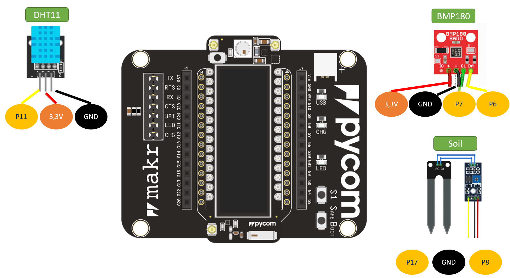
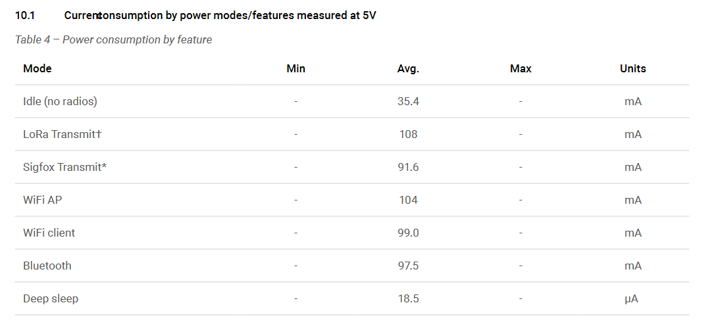
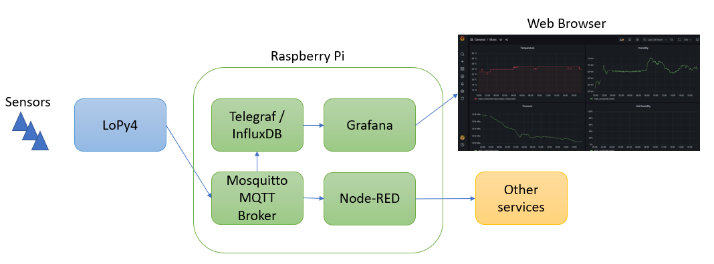
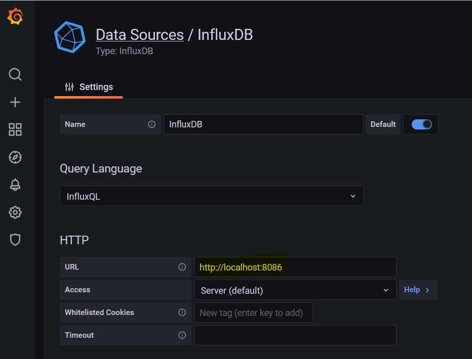
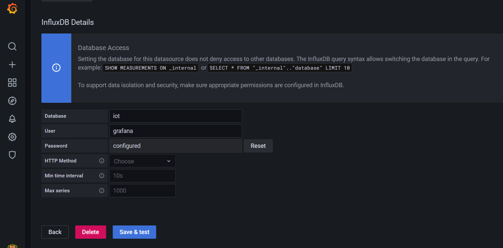
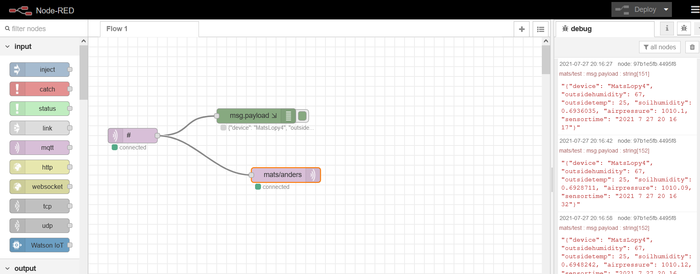
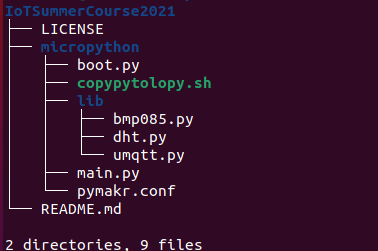
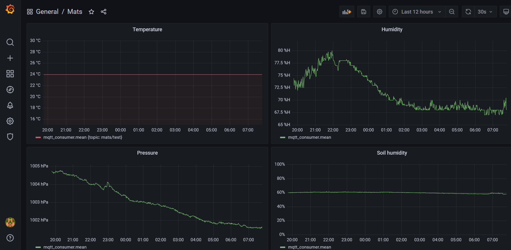

# Exploring MicroPython, MQTT and TIG Stack

**By:** Mats Pettersson (mp223ty)


# Objective

I chose this project to explore different alternatives and solutions related to middleware rather than fulfilling one specific practical use case. 

First of all, and most important, I wanted to learn about IoT and especially MicroPython devices and how they interact with sensors to collect data and how that data is shared. I also wanted to explore MQTT brokers and how to share and visualize the sensor data. 

Therefore I chose to focus on local installations in my home network on a Raspberry Pi, rather than working in a cloud environment.

In order to learn about connectivity with sensors I chose three different types: one digital, one using the I2C bus and one analogue. I measure temperature, air pressure, air humidity and soil humidity.

## In Summary 
This tutorial will guide you to get started with connecting sensors to a LoPy4 device running MicroPython and expose the sensor data using MQTT.

Note: In order to not duplicate too much information, there are some steps where I refer to the Pycom and other websites instead of repeating the information here.

## Time required (approximate)

**Step 1: (4 hours) Getting Started.** Installing your IDE of choice and connecting to the LoPy4. It should be possible to follow the instructions in this tutorial, but I strongly advice to familiarize yourself with the device and expansion board by yourself. A good place to start is [https://docs.pycom.io/gettingstarted/](https://docs.pycom.io/gettingstarted/)

**Step 2: (4 hours) Connecting the sensors** Once you are up and running with the device, it's time to start connecting the sensors. Spend some time in order to understand how to connect them. 

If you are not used to using a bread board, spend some time understanding the basics of it.

**Step 3: (2 hours) Getting the code in place.** The main.py and libraries I use can be found here: [https://github.com/matspettersson/IoTSummerCourse2021](https://github.com/matspettersson/IoTSummerCourse2021)

**Step 4: (4 hours) Install and connect device to middleware.** If you are using an MQTT Server such as Mosquitto, you probably need some hours to set it up and configure it. 

I am using a Raspberry Pi in this tutorial, and I assume that you are familiar with that environment and how to use it. If not, you will need to spend time in order to understand the Raspberry Pi environment.

**Step 5: (4 hours) The TIG stack (Telegraf, InfluxDB and Grafana).** All components are available as Docker images, but I chose to install everything locally which takes some extra time. There are many tutorials available, so some take a little time to understand the possibilities.

# Material

The sensors I use in this example are temperature, air humidity and air pressure. 

## List of material

Component | Function | Purchased | Price 
--- | --- | --- | --- 
[Lopy 4](https://pycom.io/product/lopy4/) | The actual IoT device with MicroPython |  electro:kit | 949 SEK
[Expansion board](https://pycom.io/product/expansion-board-3-0/) | PyCom Expansion board |  electro:kit | Part of bundle 
[Breadboard](https://www.electrokit.com/produkt/kopplingsdack-840-anslutningar/) | Used for connecting sensors | electro:kit | Part of bundle
 [Raspberry Pi](https://www.raspberrypi.org/products/raspberry-pi-3-model-b/) | Server running Mosquitto MQTT Broker, Telegraf, InfluxDB, Grafana and Node-RED | Webhallen | 439 SEK 
[DHT11](https://www.electrokit.com/produkt/digital-temperatur-och-fuktsensor-dht11/) | Digital temperature and humidity sensor. | electro:kit | 49 SEK 
[BMP180](https://www.electrokit.com/produkt/bmp180-lufttryckssensor-monterad-pa-kort/) | Atmospheric air pressure. Communicates via I2C and measures from 300 to 1100hPa. |  electro:kit | 69 SEK 
[Soil humidity sensor](https://www.electrokit.com/en/product/soil-hygrometer-module/) | Measures soil humidity | electro:kit | 29 SEK
[Soldering iron](https://www.kjell.com/se/produkter/el-verktyg/verktyg/lodning/lodkolvar/dibotech-lodkolvset-30-w-p40060) | For reliable contact for the sensors. | Kjell & co. | 199 SEK 

The goal with my project is not to have a "production"-like system, but rather to explore the technology and concepts. That means that my sensors are on the breadboard and connected to the LoPy4 using the breadboard cables as shown in this picture. On the breadboard the Soil humidity sensor is to the left, the DHT 11 sensor (blue) in the middle and BMP180 to the right.


# Computer setup

I use a laptop with Ubuntu 21.04 installed for development.

## Integrated Development Environment and Pymakr

There are two choices as IDE for the Pymakr plugin. Atom or Visual Studio Code. I chose Atom, but I suppose VS Code works more or less the same. 

Install Atom if not already installed:
```bash
    $ sudo snap install atom -classic
```

Installation of Node.js, extra drivers, etc.
```bash
    $ sudo apt install nodejs
```
Make sure that your user has access to the port in order to communicate with the LoPy4. Replace \<user\> with your own userid.
```bash
    $ sudo usermod -a -G dialout <user>
```
Instructions for installing the Pymakr plugin are found here https://docs.pycom.io/index.html, and there is also a GitHub repository https://github.com/pycom/pymakr-atom which helped me getting started.


## Updating and flashing the firmware

Some packages for Ubuntu are required for the tools to work. Install them if not already installed:
```bash
    $ sudo apt install dialog python-serial 
```
This is a good place to start before you update the firmware: https://docs.pycom.io/updatefirmware/. Study it before starting your update process.

**Flashing the LoPy4**
Use to Pycom firmware update tool for the LoPy.


**Flashing the expansion board**

The process for updating the expansion board is different than for the LoPy4. This is how I did.

First, install the dfu util package.
```bash
    $ sudo apt install dfu-util
```
Then, download the firmware from this link: https://docs.pycom.io/updatefirmware/
```bash
    $ dfu-util -D expansion31_0.0.11.dfu
```
I found this guide to be useful: https://alepycom.gitbooks.io/pycom-docs/content/chapter/gettingstarted/installation/firmwaretool.html#second


## Optional - erasing the filesystem

Initially I had problems connecting Atom and Pymakr with the LoPy4, but it was solved by formatting the flash memory using the command:
```bash
    $ pycom-fwtool-cli -p /dev/ttyACM0 erase_all 
```
Before running the command, you need to check which port you are using for the LoPy4:
```bash
    $ pycom-fwtool-cli list
```
Which gives me the output:

    /dev/ttyACM0  [Expansion3 - Expansion3] .....

So the port I am using is: /dev/ttyACM0.

Note: You need to reinstall the firmware after formatting the file system.

## Uploading files to the LoPy
 
To install REPL 
```bash
    $ python3 -m pip install mpy-repl-tool
```
Some useful commands to list the files on the device, remove files and put files:
```bash
    $ python3 -m there ls -l /flash/*
    $ python3 -m there rm /flash/abc.py
    $ python3 -m there push bmp180.py  /flash/lib
```

I upload the library files to the /flash/lib directory, and the main.py to the /flash directory.


## Hello world

One way to test that you have got everything ok is to get the LED on the LoPy4 to blink. So put this code in your main.py file and run it on the LoPy4.
```python
    pycom.rgbled(0xFF0000)
    time.sleep(1)
    pycom.rgbled(0x00FF00)
    time.sleep(1)
    pycom.rgbled(0x0000FF)
```

# Putting everything together


## Logical view of the connected sensors

This drawing shows how the sensors are connected to the LoPy4.



It is worth noting that the sensors operate in different ways. The BMP180 uses the I2C standard, while the DHT 11 uses one signal wire to transmit data.


## Power consumption

I am not going to run my device on battery, so I am not really concerned about power consumption. There are features to put the device into "deep sleep" and state can be stored in the NVRAM.

## LoPy4 power consumption included for reference



## Sensor power consumption

Sensor | Standby | Peak
--- | --- | --- 
BMP180 | 0.1uA | 1000uA
DHT11 | 100uA | 0.2mA
Soil humidity | ? | ?

 
# Platform(s) and components

One driver for me in this project was to not use a paid subscription. Open Source is therefore my first choice. I planned to develop APIs, but could not find a free service that met my requirements. I might continue to explore that area, but it is out of scope for this project.

My setup consists of:
- Mosquitto Message Broker for managing the MQTT events from the LoPy4.
- The TIG-stack. Telegraf for capturing the events, InfluxDB for storing the events and Grafana for visualizing the events.
- Node-RED for testing various connectivity options.

Logical view of my setup.


I decided to run the different components locally on an old Raspberry Pi. It has enough compute power for my use cases. (The green boxes in the above drawing.)

It is possible to run docker on the raspberry pi, but I chose to install all the components using their native code.

## Eclipse Mosquitto Message Broker

Eclipse Mosquitto is an open source message broker that implements the MQTT protocol versions 5.0, 3.1.1 and 3.1. 

I chose Mosquitto because it is well supported on the Raspberry Pi.

Mosquitto for Raspberry Pi can be downloaded from this link [https://mosquitto.org/download/](https://mosquitto.org/download/)

MQTT Explorer is a good tool if you want to explore your messages and your MQTT topics. It can be found here [http://mqtt-explorer.com/](http://mqtt-explorer.com/)

## InfluxDB

Time series databases is a fairly new concept for me, so I did some research and found the TIG stack interesting. It's a bundle with Telegraf, InfluxDB and Grafana. 

There are many tutorials how to install InfluxDB and Telegraf on a Raspberry Pi. I followed this one: [https://pimylifeup.com/raspberry-pi-influxdb/](https://pimylifeup.com/raspberry-pi-influxdb/)

There is one piece of information missing in the above tutorial, and I had to install the InfluxDB clients using this command:

```bash
    $ sudo apt install influxdb-client
```

When everything was installed, I created a database and users using the following commands from the *influx* client.

```console
    create database iot
    use iot

    create user grafana with password '<xyz>' with all privileges
    grant all privileges on iot to grafana

    show users
```

## Telegraf
[https://github.com/influxdata/telegraf](https://github.com/influxdata/telegraf)

My /etc/telegraf/telegraf.conf file contains the following entries:
- "[[inputs.mqtt_consumer]]" for connecting to the Mosquitto server.
- "[[outputs.influxdb]]" for connecting to the InfluxDB.

```console
    [agent]
    flush_interval = "15s"
    interval = "15s"

    [[inputs.mqtt_consumer]]
    servers = ["tcp://192.168.1.4:1883"]
    qos = 0
    connection_timeout = "30s"
    topics = [ "mats/test/#" ]
    username = "<user>"
    password = "<pw>"
    data_format = "json"

    [[outputs.influxdb]]
    database = "iot"
    urls = [ "http://influxdb:8086" ]
    username = "<user>"
    password = "<pw>"

```
I make sure that telegraf is started when the Raspberry Pi boots up:
```bash
    sudo systemctl enable --now telegraf
```
## Grafana

When you have Telegraf and InfluxDB installed, it is straightforward to configure Grafana ([https://grafana.com/](https://grafana.com/))

I followed the instructions here: [https://grafana.com/tutorials/install-grafana-on-raspberry-pi/](https://grafana.com/tutorials/install-grafana-on-raspberry-pi/)

Start with configuring a datasource.


In this example I'm running Grafana and InfluxDB on the same host, so the URL to the database is http://localhost:8086

The name of the database is *iot*, and I enter the credentials that I have specified when the database was created.


In order to create the dashboard, I specify mqtt_consumer and then the fields from the JSON string are automatically picked up. In the example below outsidehumidity is highlighted.


Grafana listens on port 3000, and in my case I reach it on the URL: [http://192.168.1.4:3000](http://192.168.1.4:3000)

## Node-RED

Node red can be used to create process flows. It can be run as a docker image using the command:

```bash
    $ docker run -it -p 1880:1880 -v myNodeREDdata:/data --name mynodered nodered/node-red:latest-minimal
```

I chose to install it native on my Raspberry Pi. Using MQTT input nodes, it is really simple to create flows and act upon the events. I tested it just to forward the events to test.mosquitto.org, and it is definitely worth exploring more. 

There is also a free version that can be used. I tested out this one: http://sensetecnic.com/products-and-services/fred-build-iot-apps-faster/

Locally I connect to it using: http://192.168.1.4:1880. Currently I only use it for forwarding events to test.mosquitto.org, so an old friend of mine can consume my soil humidity data. But it can be used for more complex scenarios.


# The code

This is how the file tree of my projects looks like:


The code is available in my GitHub repository here: [https://github.com/matspettersson/IoTSummerCourse2021](https://github.com/matspettersson/IoTSummerCourse2021)

All my logic is in main.py and I have defined functions for:
- **connect_to_wlan()**. This method connects to the wifi router.
- **setRTCLocalTime()**. Sets the local time for the device. I could use the time from when the message hits the Mosquitto message broker, but I chose this design to have all the information from the source in the events.
- **connect_to_mqtt()**. Connects to the Mosquitto message broker. I am trying to catch the event if the Mosquitto server isn't available, but currently this doesn't work. In that case, the whole program will terminate, which I think is bad programming practice.
- **humid_temp_sensor()**. Reads from the DHT11 sensor that currently is connected to pin 11.
- **get_pressure()**. Connects to the BMP180 sensor and returns temp, pressure and altitude.


The main loop:

1. connects to the wlan
2. sets the local time
3. Loops forever. 

In the loop:
1. gets the time
2. gets temperature and humidity
3. gets the pressure
4. creates a JSON dictionary with the data.
5. connects to Mosquitto server
6. publishes the JSON dictionary to the mats/test topic
7. disconnects from Mosquitto server
8. sleeps for 5 seconds

# Transmitting the data / connectivity

All data is packaged as a JSON dictionary in the following format:

    {"device": "MatsLopy4", "outsidehumidity": 53, "outsidetemp": 25, "airpressure": 1018.61, "soilhumidity": 0.6999512, "sensortime": "2021 7 12 14 40 39"}

JSON is a good structure for the message if using Node-RED for example, it can automatically be parsed.

The JSON message is sent to the Mosquitto Message Broker using MQTT approximately every 15th second, where it can be "consumed" by any client listening for the *mats/test* topic.

I chose to package all the sensor data into one event instead of separate events for each sensor type.

I keep all the information in my home network, so for this scenario I only connect the LoPy4 to my home router and the Raspberry Pi. I'm curious about LoRa and will explore that in a later test, but currently I only use WiFi.


# Presenting the data



I was planning to build an API to present the data, but I got curious about what Grafana could do, and it met all my expectations. It is easy to define panels in the dashboard and it works really well with InfluxDB.

Other datasources can be connected and there is a large number of connectors that can be used.

Grafana has options to create triggers based on different thresholds. I have not tested that, and at least what I think right now, I think the triggering should not be part of the dashboard. Rather I would use Node-RED or other MQTT clients to act on events.

I have not yet implemented any housekeeping in the database, but the volumes are small, and it will take a long time to fill the space.

# Finalizing the design

There are of course many things I could have done differently.

## MicroPython
I could have dived deeper into the MicroPython part and learned more about the possibilities there. Error handling could be improved and as it is now, the script stops if it can't connect to the Mosquitto server.

Also, the readings from the soil humidity sensor is not reliable.

## MQTT
There are probably standards for naming the topics and the attributes which I have not explored further. If I had aimed for a more production ready solution, I would probably benefited from looking into that.

## No APIs
I suppose it would be not so hard to develop an application for example on Heroku using a free account, and from that listen to test.mosquitto.org for the topics I publish my sensor data on, and then store the information in a PostgresSQL database. And on top of that develop a REST API that could get the data.

## The actual device and the packaging of the sensors
The sensors are just placed on the breadboard with wires to the LoPy4. I could have developed a more robust solution in a box, packaged with a battery instead of USB chargers. This was never my intention, but it would be interesting to explore 3D-printing and how to use it for making a more professional package of the bundle.


## Video presentation

